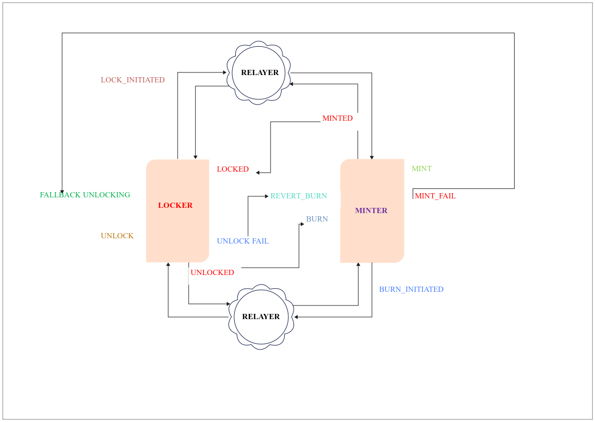

# SX-Relayer - Cross-Chain Asset Transfer Interface

## Introduction
`SX-Relayer` is a front-end application that enables seamless cross-chain asset transfers between different blockchain networks. It interacts with locker and minter smart contracts, allowing users to lock, mint, and burn tokens as part of the transfer process.

## Architecture

## Cross-Chain Transfer Flow
The following ASCII diagram illustrates the basic flow of the cross-chain asset transfer process:

## Technology Stack
- **Front-End**: Vue.js
- **Smart Contracts**: Locker and Minter contracts.
- **Blockchain Networks**: Sepolia, EVM-compatible XRPL Sidechain, etc.

## Getting Started
Set up instructions:
1. Clone the repository: `git clone https://github.com/sap200/sxrelayer`
2. Install dependencies: `npm install`
4. Run the application: `npm run serve`

## Contributing
Guidelines for contributing:
- Fork the repo and create a new branch
- Follow coding standards
- Submit pull requests with comprehensive descriptions

